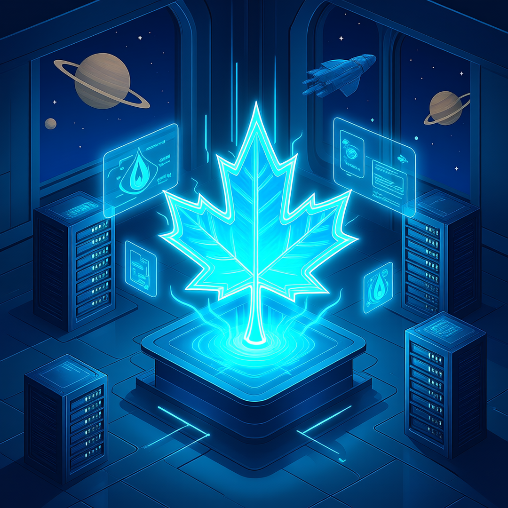

[English](#english) | [Français](#français)

<a id="english"></a>

# Vertical Pod Autoscaler (VPA) Usage Guide

## Right-sizing Your Container Resources on Aurora Platform

**Date:** 2026-10-02  
**Author:** Bryan Paget, Aurora Platform Team

---

## About This Repository

This repository contains the source for a bilingual (English/French) presentation on Vertical Pod Autoscaler (VPA) usage for the Aurora Platform. It builds presentation slides (via [Marp](https://marp.app/)) and publishes the slides as HTML to GitHub Pages from the `docs/` folder.

| Path | Description |
|------|-------------|
| `content/slides-en.md` | English Marp presentation source |
| `content/slides-fr.md` | French Marp presentation source |
| `config/header.md` | Shared Marp theme and front-matter |
| `config/landing.html` | GitHub Pages landing page (copied to `docs/index.html`) |
| `img/` | Slide images |
| `docs/` | Generated GitHub Pages site (built via `make html`, committed) |
| `.github/workflows/` | CI (build) and release workflows |

**View the slides online:** <https://github.com/gccloudone-aurora/vpa-presentation/>

### Build Locally

```bash
make pdf       # EN + FR presentation PDFs (requires marp CLI + Chromium)
make html      # GitHub Pages site into docs/
make preview-en / preview-fr   # live slide preview on localhost
```

> **Note on deployments:** GitHub Pages serves the committed `docs/` folder (repo **Settings → Pages → Source → "Deploy from a branch" → branch `main`, folder `/docs`**). After editing slides, run `make html` and commit the regenerated `docs/`; the site updates on push. Tagging a release with `v*` builds the PDFs and attaches them to a GitHub Release.

---

## Executive Summary

**Recommendation:** Adopt VPA as our vertical scaling solution complementing HPA for horizontal scaling on Aurora.

**What:** VPA automatically adjusts CPU and memory resource *requests* for your containers based on actual usage patterns. Unlike HPA which scales the number of replicas, VPA right-sizes the resource requests/limits of individual containers.

**Why now:** Resource optimization is critical for cluster efficiency and cost management. VPA eliminates manual resource guessing and ensures optimal resource allocation.

**Risk:** Low. VPA is already deployed on the Aurora platform (via aurora-core chart). The admission controller ensures safe pod creation with appropriate resource requests.

**Cost:** Minimal. VPA runs as system components (recommender, updater, admission-controller) with <1% overhead on the control plane.

**Ask:** Approve the VPA implementation pattern documented in this presentation and deploy to Zone DEV for validation with your workloads.

**Next steps:** Review this presentation, deploy VPA to DEV, validate with your workloads, and share findings with the team.

---

## Table of Contents

1. [What is VPA?](#10-what-is-vpa)  
2. [VPA vs HPA: Two Sides of Scaling](#20-vpa-vs-hpa-two-sides-of-scaling)  
3. [Why VPA Matters](#30-why-vpa-matters)  
4. [VPA Modes and recommended Production Patterns](#40-vpa-modes-and-recommended-production-patterns)  
5. [Aurora Platform Defaults](#50-aurora-platform-defaults)  
6. [How VPA Works](#60-how-vpa-works)  
7. [Enabling VPA on Your Workload](#70-enabling-vpa-on-your-workload)  
8. [VPA + HPA Integration](#80-vpa--hpa-integration)  
9. [Production Guardrails](#90-production-guardrails)  
10. [Troubleshooting](#100-troubleshooting)  
11. [Implementation Plan](#110-implementation-plan)  
12. [Conclusion](#120-conclusion)  

---

## 1.0 What is VPA?

**Vertical Pod Autoscaler (VPA):** Automatically adjusts CPU and memory resource *requests* for your containers based on actual usage patterns.



- Unlike HPA which scales *replicas*, VPA scales *resource requests*
- Works with Deployments, StatefulSets, DaemonSets
- Two-phase: Recommender (analyze) + Updater (apply)
- Kubernetes-native via Custom Resource Definitions

<blockquote>
HPA scales how many, VPA scales how much.
</blockquote>

**Learn more:** <a href="https://github.com/kubernetes/autoscaler/blob/master/vertical-pod-autoscaler/README.md">VPA GitHub</a>

---

## 2.0 VPA vs HPA: Two Sides of Scaling


| Component | What it Scales | How it Works | When to Use |
|-----------|---------------|--------------|-------------|
| **HPA** | Number of replicas | Scales pods up/down based on metrics | CPU/memory utilization, custom metrics, off-hours scaling |
| **VPA** | Resource requests per container | Adjusts CPU/memory requests based on usage | Right-sizing container resources, reducing over-provisioning |

<blockquote>
HPA answers "how many pods?" VPA answers "how much resources per pod?"
</blockquote>

---

## 3.0 Why VPA Matters


### The Resource Request Problem:
- Over-provisioning: 500m CPU when 100m needed → wasted capacity
- Under-provisioning: 100m CPU when 500m needed → throttling
- Static requests: Never adjust after deployment

### VPA Solves This:
- **Continuous monitoring:** Analyzes actual usage patterns
- **Automatic adjustment:** Updates resource requests over time
- **Right-sizing:** Optimizes cluster resource utilization

<blockquote>
Stop guessing, start sizing with data.
</blockquote>

---

## 4.0 VPA Modes and Recommended Production Patterns


| Mode | Updates Existing Pods | Evicts Pods | Production Use |
|------|----------------------|-------------|----------------|
| **Off** | No | No | Analysis only |
| **Initial** | No | No | Recommended for prod |
| **InPlace** | Yes (in-place) | No | Recommended for prod |
| **InPlaceOrRecreate** | Yes (fallback) | Yes | Balanced approach |
| **Recreate** | Yes | Yes | Use rarely |
| **Auto** | Deprecated | Deprecated | Do not use |

**Key distinction:** "Initial" only updates new pods, "InPlace" updates existing pods without eviction.

---

## 5.0 Aurora Platform Defaults


| Setting | Value | Description |
|---------|-------|-------------|
| VPA Version | 0.13.0 (appVersion 1.8.0) | Vertical Pod Autoscaler chart |
| Namespace | vpa-system | VPA components deployment |
| Metrics Server | Enabled | Required for VPA to collect usage metrics |
| Admission Controller | Enabled | Mutating webhook for pod creation |
| Prometheus/ServiceMonitor | Disabled | Can be enabled per workload |

**Deployment:** Via aurora-core chart in `vpa-system` namespace

---

## 6.0 How VPA Works: Three Components


### 1. Recommender
- Analyzes resource usage patterns over time
- Calculates recommended resource requests/limits
- Runs continuously, updates recommendations

### 2. Updater
- Checks VPA recommendations against current pod specs
- Decides whether/when to update pods
- Respects PDB, rollout status, replica count

### 3. Admission Controller (Mutating Webhook)
- Intercepts pod creation/update requests
- Applies VPA recommendations at pod admission time
- Ensures new pods get right-sized resources

---

## 7.0 Enabling VPA on Your Workload


### Step 1: Platform-Level (Already Done)
```yaml
# In config/config.yaml (aurora-core)
components:
  vpa:
    enabled: true
    metricsServer:
      enabled: true  # Required
```

### Step 2: Workload-Level (Your Turn)
```yaml
apiVersion: autoscaling.k8s.io/v1
kind: VerticalPodAutoscaler
metadata:
  name: my-app-vpa
  namespace: my-namespace
spec:
  targetRef:
    apiVersion: apps/v1
    kind: Deployment
    name: my-app
  updatePolicy:
    updateMode: "Initial"  # Or "InPlace"
```

---

## 8.0 VPA + HPA Integration


### The Division of Responsibility:
- **HPA** → Scales replicas (how many pods)
- **VPA** → Scales resources (how much per pod)

### Critical: Use `controlledResources`

```yaml
# HPA manages CPU scaling (replicas)
apiVersion: autoscaling/v2
kind: HorizontalPodAutoscaler
spec:
  metrics:
    - type: Resource
      resource:
        name: cpu
        target:
          type: Utilization
          averageUtilization: 70

# VPA manages ONLY memory (avoid conflict)
apiVersion: autoscaling.k8s.io/v1
kind: VerticalPodAutoscaler
spec:
  resourcePolicy:
    containerPolicies:
      - containerName: "*"
        controlledResources: ["memory"]  # VPA only manages memory
```

---

## 9.0 Production Guardrails


### DO NOT:

1. **Use Auto mode** - Deprecated and removed in future versions
2. **Combine VPA with HPA on same resources** - Conflict inevitable
3. **Enable VPA for batch jobs** - Use KEDA Jobs instead
4. **Set minReplicaCount < 2 with Recreate** - Updater defaults to 2

### DO:

1. **Use Initial or InPlace mode** - Minimize disruption
2. **Set controlledResources** - Avoid HPA/VPA conflicts
3. **Monitor recommendations** - Check VPA status weekly
4. **Use resource policy limits** - Define min/max bounds

---

## 10.0 Troubleshooting


### Problem: VPA not generating recommendations
```bash
# Check Metrics Server
kubectl top nodes
kubectl top pods -n my-namespace

# Check VPA recommender logs
kubectl logs -n vpa-system deployment/vpa-recommender
```

### Problem: Recommendations not applied
```bash
# Check VPA components running
kubectl get pods -n vpa-system

# Check admission controller
kubectl logs -n vpa-system deployment/vpa-admission-controller
```

### Problem: Pods being evicted
```bash
# Check VPA mode
kubectl get vpa my-app-vpa -o yaml

# Consider switching to InPlace or Initial mode
```

---

## 11.0 Implementation Plan


### Phase 1: Validation in DEV (Weeks 1-2)
- Deploy VPA to Zone DEV
- Apply baseline policies to test workloads
- Monitor recommendations and overhead
- Document findings

### Phase 2: Production Readiness (Weeks 3-4)
- Define SLOs for recommendation accuracy
- Create documentation and runbooks
- Create Terraform module for aurora-platform-charts
- Integrate with cluster provisioning

### Phase 3: Automation & Handover (Weeks 5-6)
- CI/CD pipeline for VPA policy updates
- Alerting on VPA issues
- Training and documentation
- Organization-wide rollout

---

## 12.0 Conclusion


- **What:** VPA is a Kubernetes-native tool for right-sizing container resources
- **Why:** Reduces waste, improves cluster efficiency, complements HPA
- **How:** Recommender analyzes → Updater applies → Admission controller enforces
- **Next Step:** Deploy to DEV, validate with your workloads, share findings

<blockquote>
Right-size your resources, optimize your cluster, reduce costs.
</blockquote>

---

## References


### VPA Documentation:
1. <a href="https://github.com/kubernetes/autoscaler/blob/master/vertical-pod-autoscaler/README.md">VPA GitHub Repository</a>
2. <a href="https://kubernetes.io/docs/tasks/run-application/horizontal-pod-autoscale/">Kubernetes Horizontal Pod Autoscaling</a>
3. <a href="https://kubernetes.io/docs/concepts/configuration/manage-resources-containers/">Kubernetes Resource Management</a>

### Aurora Platform:
4. <a href="https://github.com/gccloudone-aurora/aurora-platform-charts">Aurora Platform Charts</a>
5. VPA Implementation Issue #473
6. VPA Documentation Epic #488

---

<a id="français"></a>

# Guide d'utilisation du Vertical Pod Autoscaler (VPA)

## Dimensionnement correct des ressources de vos conteneurs sur la plateforme Aurora

**Date :** 2026-10-02  
**Auteur :** Bryan Paget, Équipe Aurora Platform

---

## À propos de ce dépôt

Ce dépôt contient la source d'une présentation bilingue (anglais/français) sur l'utilisation du Vertical Pod Autoscaler (VPA) pour la plateforme Aurora. Il génère des diapositives de présentation (via [Marp](https://marp.app/)) et publie les diapositives en tant que HTML sur GitHub Pages à partir du dossier `docs/`.

| chemin | description |
|--------|-------------|
| `content/slides-en.md` | Source de la présentation Marp en anglais |
| `content/slides-fr.md` | Source de la présentation Marp en français |
| `config/header.md` | Thème Marp partagé et front-matter |
| `config/landing.html` | Page d'accueil GitHub Pages (copiée dans `docs/index.html`) |
| `img/` | Images des diapositives |
| `docs/` | Site GitHub Pages généré (construit via `make html`, commit) |
| `.github/workflows/` | CI (build) et workflows de release |

**Voir les diapositives en ligne :** <https://github.com/gccloudone-aurora/vpa-presentation/>

### Construire localement

```bash
make pdf       # PDF de présentation EN + FR (nécessite marp CLI + Chromium)
make html      # Site GitHub Pages dans docs/
make preview-en / preview-fr   # prévisualisation en direct des diapositives sur localhost
```

> **Note sur les déploiements :** GitHub Pages sert le dossier `docs/` commit (dépôt **Settings → Pages → Source → "Deploy from a branch" → branche `main`, dossier `/docs`**). Après avoir modifié les diapositives, exécutez `make html` et committez les `docs/` régénérés ; le site se met à jour à la push. Taguer une release avec `v*` construit les PDFs et les attache à une Release GitHub.

---

## Résumé exécutif

**Recommandation :** Adopter VPA comme solution de dimensionnement vertical complémentaire à HPA pour le dimensionnement horizontal sur Aurora.

**Quoi :** VPA ajuste automatiquement les demandes de ressources CPU et mémoire *requests* pour vos conteneurs selon les modèles d'utilisation réels. Contrairement à HPA qui met à l'échelle le nombre de réplicas, VPA dimensionne correctement les demandes/limites de ressources des conteneurs individuels.

**Pourquoi maintenant :** L'optimisation des ressources est critique pour l'efficacité du cluster et la gestion des coûts. VPA élimine les suppositions manuelles sur les ressources et garantit une allocation optimale des ressources.

**Risque :** Faible. VPA est déjà déployé sur la plateforme Aurora (via le chart aurora-core). Le contrôleur d'admission garantit une création de pod安全 avec des demandes de ressources appropriées.

**Coût :** Minimal. VPA s'exécute en tant que composants système (recommandeur, updateur, contrôleur d'admission) avec moins de 1% de surcharge sur le plan de contrôle.

**Demande :** Approuver le modèle d'implémentation VPA documenté dans cette présentation et le déployer dans DEV de la Zone pour validation avec vos workloads.

**Prochaines étapes :** Examinez cette présentation, déployez VPA dans DEV, validez avec vos workloads, et partagez les résultats avec l'équipe.

---

## Table des matières

1. [Qu'est-ce que VPA?](#10-quest-ce-que-vpa)  
2. [VPA vs HPA: Deux côtés du dimensionnement](#20-vpa-vs-hpa-deux-côtés-du-dimensionnement)  
3. [Pourquoi VPA est important](#30-pourquoi-vpa-est-important)  
4. [Modes VPA et modèles recommandés pour la production](#40-modes-vpa-et-modèles-recommandés-pour-la-production)  
5. [Valeurs par défaut de la plateforme Aurora](#50-valeurs-par-défaut-de-la-plateforme-aurora)  
6. [Comment VPA fonctionne](#60-comment-vpa-fonctionne)  
7. [Activer VPA sur votre workload](#70-activer-vpa-sur-votre-workload)  
8. [Intégration VPA + HPA](#80-intégration-vpa--hpa)  
9. [Cadres de sécurité pour la production](#90-cadres-de-sécurité-pour-la-production)  
10. [Dépannage](#100-dépannage)  
11. [Plan de mise en œuvre](#110-plan-de-mise-en-œuvre)  
12. [Conclusion](#120-conclusion)  

---

## 1.0 Qu'est-ce que VPA?

**Vertical Pod Autoscaler (VPA):** Ajuste automatiquement les demandes de ressources CPU et mémoire *requests* pour vos conteneurs selon les modèles d'utilisation réels.


- Contrairement à HPA qui dimensionne les *réplicas*, VPA dimensionne les *demandes de ressources*
- Fonctionne avec les Deployments, StatefulSets et DaemonSets
- Deux phases: Recommandeur (analyse) + Updateur (applique)
- Native Kubernetes via les Custom Resource Definitions

<blockquote>
HPA répond "combien de pods?" VPA répond "combien de ressources par pod?"
</blockquote>

**En savoir plus :** <a href="https://github.com/kubernetes/autoscaler/blob/master/vertical-pod-autoscaler/README.md">VPA GitHub</a>

---

## 2.0 VPA vs HPA: Deux côtés du dimensionnement


| Composant | Ce qu'il scale | Comment ça marche | Quand utiliser |
|-----------|---------------|-------------------|----------------|
| **HPA** | Nombre de réplicas | Scale les pods up/down selon les métriques | Utilisation CPU/mémoire, métriques personnalisées, mise à l'échelle hors heures de pointe |
| **VPA** | Demandes de ressources par conteneur | Ajuste les demandes CPU/mémoire selon l'utilisation | Dimensionnement correct des ressources de conteneur, réduction de la sur-provisionnement |

<blockquote>
HPA répond "combien de pods?" VPA répond "combien de ressources par pod?"
</blockquote>

---

## 3.0 Pourquoi VPA est important


### Le problème des demandes de ressources:
- Sur-provisionnement: 500m CPU quand 100m suffisent → capacité gaspillée
- Sous-provisionnement: 100m CPU quand 500m sont nécessaires → limitation
- Demandes statiques: Ne jamais ajuster après le déploiement

### VPA résout cela:
- **Surveillance continue:** Analyse les modèles d'utilisation au fil du temps
- **Ajustement automatique:** Met à jour les demandes de ressources au fil du temps
- **Dimensionnement correct:** Optimise l'utilisation des ressources du cluster

<blockquote>
Cesser de deviner, commencer à dimensionner avec des données.
</blockquote>

---

## 4.0 Modes VPA et modèles recommandés pour la production


| Mode | Met à jour les pods existants | Éjecte les pods | Utilisation en production |
|------|------------------------------|-----------------|---------------------------|
| **Off** | Non | Non | Analyse seulement |
| **Initial** | Non | Non | Recommandé pour prod |
| **InPlace** | Oui (en place) | Non | Recommandé pour prod |
| **InPlaceOrRecreate** | Oui (fallback) | Oui | Approche équilibrée |
| **Recreate** | Oui | Oui | À utiliser rarement |
| **Auto** | Déconseillé | Déconseillé | Ne pas utiliser |

**Distinction clé:** "Initial" ne met à jour que les nouveaux pods, "InPlace" met à jour les pods existants sans les éjecter.

---

## 5.0 Valeurs par défaut de la plateforme Aurora


| Paramètre | Valeur | Description |
|-----------|--------|-------------|
| Version VPA | 0.13.0 (appVersion 1.8.0) | Chart Vertical Pod Autoscaler |
| Espace de noms | vpa-system | Déploiement des composants VPA |
| Metrics Server | Activé | Requis pour que VPA collecte les métriques d'utilisation |
| Contrôleur d'admission | Activé | Webhook modifiant pour la création de pod |
| Prometheus/ServiceMonitor | Désactivé | Peut être activé par workload |

**Déploiement:** Via le chart aurora-core dans l'espace de noms `vpa-system`

---

## 6.0 Comment VPA fonctionne: Trois composants


### 1. Recommandeur
- Analyse les modèles d'utilisation des ressources au fil du temps
- Calcule les demandes de ressources recommandées
- S'exécute en continu, met à jour les recommandations

### 2. Updateur
- Vérifie les recommandations VPA par rapport aux spécifications de pod actuelles
- Décide s'il faut mettre à jour les pods et quand
- Respecte les PDB, le statut du rollout et le nombre de réplicas

### 3. Contrôleur d'admission (Webhook modificateur)
- Intercepte les requêtes de création/mise à jour de pod
- Applique les recommandations VPA au moment de l'admission du pod
- Garantit que les nouveaux pods reçoivent des ressources adaptées

---

## 7.0 Activer VPA sur votre workload


### Étape 1: Niveau plateforme (déjà fait)
```yaml
# Dans config/config.yaml (aurora-core)
components:
  vpa:
    enabled: true
    metricsServer:
      enabled: true  # Requis
```

### Étape 2: Niveau workload (à votre tour)
```yaml
apiVersion: autoscaling.k8s.io/v1
kind: VerticalPodAutoscaler
metadata:
  name: my-app-vpa
  namespace: my-namespace
spec:
  targetRef:
    apiVersion: apps/v1
    kind: Deployment
    name: my-app
  updatePolicy:
    updateMode: "Initial"  # Ou "InPlace"
```

---

## 8.0 Intégration VPA + HPA


### La division des responsabilités:
- **HPA** → Sacle les réplicas (combien de pods)
- **VPA** → Sacle les ressources (combien par pod)

### Critique: Utiliser `controlledResources`

```yaml
# HPA gère le scaling CPU (réplicas)
apiVersion: autoscaling/v2
kind: HorizontalPodAutoscaler
spec:
  metrics:
    - type: Resource
      resource:
        name: cpu
        target:
          type: Utilization
          averageUtilization: 70

# VPA gère SEULEMENT la mémoire (éviter le conflit)
apiVersion: autoscaling.k8s.io/v1
kind: VerticalPodAutoscaler
spec:
  resourcePolicy:
    containerPolicies:
      - containerName: "*"
        controlledResources: ["memory"]  # VPA ne gère que la mémoire
```

---

## 9.0 Cadres de sécurité pour la production


### NE PAS:

1. **Utiliser le mode Auto** - Déconseillé et supprimé dans les versions futures
2. **Combiner VPA avec HPA sur les mêmes ressources** - Conflit inévitable
3. **Activer VPA pour les batch jobs** - Utiliser KEDA Jobs à la place
4. **Définir minReplicaCount < 2 avec Recreate** - L'updateur par défaut est 2

### FAIRE:

1. **Utiliser les modes Initial ou InPlace** - Minimiser la perturbation
2. **Définir controlledResources** - Éviter les conflits HPA/VPA
3. **Surveiller les recommandations** - Vérifier l'état VPA hebdomadairement
4. **Utiliser les limites de politiques de ressources** - Définir les bornes min/max

---

## 10.0 Dépannage


### Problème: VPA ne génère pas de recommandations
```bash
# Vérifier Metrics Server
kubectl top nodes
kubectl top pods -n my-namespace

# Vérifier les journaux du recommandeur VPA
kubectl logs -n vpa-system deployment/vpa-recommender
```

### Problème: Recommandations non appliquées
```bash
# Vérifier que les composants VPA sont en cours d'exécution
kubectl get pods -n vpa-system

# Vérifier le contrôleur d'admission
kubectl logs -n vpa-system deployment/vpa-admission-controller
```

### Problème: Pods being éjectés
```bash
# Vérifier le mode VPA
kubectl get vpa my-app-vpa -o yaml

# Envisager de passer au mode InPlace ou Initial
```

---

## 11.0 Plan de mise en œuvre


### Phase 1: Validation en DEV (semaines 1-2)
- Déployer VPA dans Zone DEV
- Appliquer les politiques de base aux workloads de test
- Surveiller les recommandations et la surcharge
- Documenter les résultats

### Phase 2: Préparation à la production (semaines 3-4)
- Définir les SLO pour la précision des recommandations
- Créer la documentation et les livres de procédures
- Créer le module Terraform pour aurora-platform-charts
- Intégrer avec le provisionnement de cluster

### Phase 3: Automatisation et transmission (semaines 5-6)
- Pipeline CI/CD pour les mises à jour des politiques VPA
- Alertes sur les problèmes VPA
- Formation et documentation
- Rollout organisationnel

---

## 12.0 Conclusion


- **Quoi:** VPA est un outil natif Kubernetes pour le dimensionnement correct des ressources de conteneur
- **Pourquoi:** Réduit le gaspillage, améliore l'efficacité du cluster, complète HPA
- **Comment:** Recommandeur analyse → Updateur applique → Contrôleur d'admission applique
- **Prochaine étape:** Déployer dans DEV, valider avec vos workloads, partager les résultats

<blockquote>
Dimensionnez correctement vos ressources, optimisez votre cluster, réduisez les coûts.
</blockquote>

---

## Références


### Documentation VPA:
1. <a href="https://github.com/kubernetes/autoscaler/blob/master/vertical-pod-autoscaler/README.md">Dépôt GitHub VPA</a>
2. <a href="https://kubernetes.io/docs/tasks/run-application/horizontal-pod-autoscale/">Dimensionnement horizontal des pods Kubernetes</a>
3. <a href="https://kubernetes.io/docs/concepts/configuration/manage-resources-containers/">Gestion des ressources Kubernetes</a>

### Plateforme Aurora:
4. <a href="https://github.com/gccloudone-aurora/aurora-platform-charts">Charts de la plateforme Aurora</a>
5. Problème d'implémentation VPA #473
6. Épopée de documentation VPA #488
